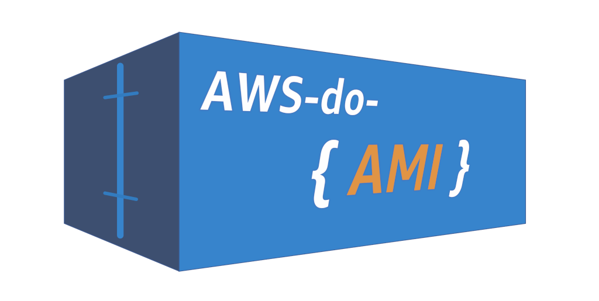

# AWS do AMI (aws-do-ami) - <br/>Create and manage your Amazon Machine Images (AMI) using the [do-framework](https://bit.ly/do-framework) 

## Overview
[Amazon Machine Images (AMI)](https://docs.aws.amazon.com/AWSEC2/latest/UserGuide/AMIs.html) are machine images that contain the information required to launch [EC2 instances](https://aws.amazon.com/ec2/). This project builds a container that is equipped with [HashiCorp Packer](https://www.packer.io/), other tools and utility scripts that help with building and management of Amazon Machine Images. Example AMI recipes as well as references to other related projects are provided. The goal of this project is to make building and management of Amazon Machine Images easy by following the principles of the [do-framework](https://bit.ly/do-framework).

## Prerequisites

* [Git](https://git-scm.com/downloads) - needed to clone this project
* [Docker](https://docs.docker.com/get-docker/) - needed to build and run the project
* [AWS CLI Credentials](https://docs.aws.amazon.com/cli/latest/userguide/cli-authentication-user.html) - needed to access AWS APIs

## Build

Execute `./build.sh` to build the `aws-do-ami` container image.

## Run

Execute `./run.sh` to start the `aws-do-ami` container.

## Status

The `./status.sh` script shows the current state of the `aws-do-ami` container.

## Exec

Run the `./exec.sh` script to open a shell in the `aws-do-ami` container. All tools, the `packer` cli, and utility scripts are available in the /ami directory.

### Utility scripts

* `ami-create.sh [name]` - create an ami from the packer reciple in folder `/wd/packer/<name>`
* `ami-delete.sh <AMI_ID>` - deregister specified ami from account 
* `ami-dir.sh` - list local packer-based ami recipes 
* `ami-list.sh` - list ami's owned by the current AWS account 
* `aws-config.sh` - configure aws client
* `ec2-launch.sh` - launch an EC2 instance from ami as configured in `wd/conf/ec2.conf`
* `ec2-list.sh` - list all EC2 instances in the configured account and region
* `ec2-profiles.sh` - list available instance profiles
* `ec2-start.sh <instance_id>` - start a stopped EC2 instance
* `ec2-stop.sh <instance_id>` - stop a running EC2 instance
* `ec2-terminate.sh <instance_id>` - terminate the specified EC2 instance
* `keypair-create.sh [KEYPAIR_NAME]` - create ssh key pair with specified name
* `keypair-delete.sh [KAYPAIR_NAME]` - delete the specified key pair
* `keypair-list.sh` - list available ssh key pairs
* `packer-dir.sh` - list local packer-based ami recipes in tree format
* `project-dir.sh` - list in tree format well-known other projects for building ami's
* `sg-create.sh` - create a security group and allow SSH access from the current IP address
* `sg-delete.sh <sg_id>` - delete the specified security group
* `sg-list.sh` - list available security groups
* `stack-delete.sh <stack_name>` - delete cloud formation stack by name
* `stack-list.sh` - list completed cloud formation stacks
* `vpc-list.sh` - list current VPCs in the region
* `vpc-subnets.sh <vpc_id>` - list subnets belonging to the specified vpc

## Stop

Execute the `./stop.sh` script to stop and remove the `aws-do-ami` container.

## Workflow

As previously described, this project builds a container that is equipped with tools needed for creating AMI's on AWS. It includes a library of AMI recipes and references to other projects for building AMI's, all useable within the container. A typical workflow is described below:

1. Clone the project 
```bash
git clone https://github.com/aws-samples/aws-do-ami
cd aws-do-ami
```
2. Build the `aws-do-ami` container image
```bash
./build.sh
```
3. Run the `aws-do-ami` container
```bash
./run.sh
```
4. Open a shell into the container
```bash
./exec.sh
```
5. Configure AWS credentials
```bash
./aws-config.sh
```
6. List available AMI recipes
```bash
./packer-dir.sh
```
Advanced users may customize the existing or create their own ami recipes in the working directory `wd/packer`.

7. Build selected AMI by recipe name
```bash
./ami-create.sh <ami_recipe_name>
```
8. Repeat steps 6 and 7 as needed

Alternatively, other well-known projects for building AMIs can be cloned and used within the `aws-do-ami` container.
You may list these projects in place of step 6 by using the `./project-dir.sh` command. To select one of the projects, change your current directory `cd project/<path>`, then run the corresponding `clone-` script.

Example:
```
./project-dir.sh
project
└── github.com
    ├── aws-samples
    │   └── awsome-distributed-training
    ├── awslabs
    │   └── amazon-eks-ami
    └── clowdhaus
        └── amazon-eks-gpu-ami
```

```
cd project/github.com/aws-eks-ami
./clone-aws-eks-ami.sh
```

Refer to the README of your selected project for instructions about building AMIs. The tools needed by the project should already be included in the `aws-do-ami` container. Advanced users may customize these projects or add new ones. If any new tools are needed, they can be added to the [`setup.sh`](Container-Root/setup.sh) script of the `aws-do-ami` project. Changes to this script take effect after the container is built using `./build.sh` and restarted using `./stop.sh` and `./run.sh`. 

## Security

See [CONTRIBUTING](CONTRIBUTING.md#security-issue-notifications) for more information.

## License

This project is licensed under the MIT-0 License. See the LICENSE file.

## References
* [Docker](https://docker.com)
* [do-framework](https://bit.ly/do-framework)
* [depend-on-docker](https://bit.ly/do-docker-project)
* [Amazon Machine Images](https://docs.aws.amazon.com/AWSEC2/latest/UserGuide/AMIs.html)
* [Amazon EC2 Instance Types](https://aws.amazon.com/ec2/instance-types/)
* [Packer](https://www.packer.io/)
* [Ansible](https://github.com/ansible/ansible)
* [awsome-distributed-training](https://github.com/aws-samples/awsome-distributed-training)
* [amazon-eks-ami](https://github.com/awslabs/amazon-eks-ami)
* [amazon-eks-gpu-ami](https://github.com/clowdhaus/amazon-eks-gpu-ami)
